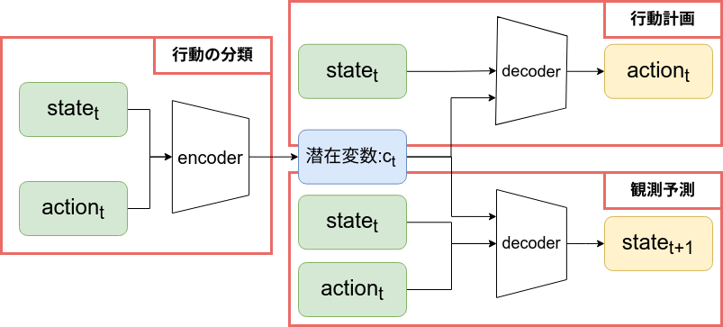

# DoorGym

[doorgym_video]: ./imgs/doorgym_video.gif
##複数方策の模倣学習および逸脱時の行動変更モデル in ドア開けタスク
同じ視覚情報で、開け方が押す引く2通りある環境で、2種類の開け方のデモデータから模倣学習。
<p align="center">
  
  
</p>


- [x] Doo
##


### 0. タスク環境
ファイルが増えすぎるのでこのディレクトリには入れていませんが、[DoorGym](https://github.com/PSVL/DoorGym)をcloneしてset upすると実際にシミュレーションできます。

### 1. スクリプト説明
提案手法は主に以下の3つのスクリプトによって実装されている。
- run_proposedmodel.py
- propmodels.py
- proputils.py
それぞれについて説明する。

`run_proposedmodel.py`は学習を実行するためのコードで、
```bash
python run_proposedmodel.py
```
で学習をして,ロスを`~/proposed_model/loss_epoch:500_batch_512.png`に,
モデルを`~/proposed_model/detector.json`に出力します。

`propmodels.py`は以下の図に示すようなモデルを540行以降で実装している。比較実験のためのモデル(InfoGAIL)なども一部ここで定義されている。
<p align="center">
  
</p>

`proputils.py`は種々の必要な関数を定義している。

## Reference
Mujocoでのドア開けタスク環境やエージェントの学習則は以下のレポジトリを参照した。
- [DoorGym](https://github.com/PSVL/DoorGym)
- [InfoGAIL](https://github.com/YunzhuLi/InfoGAIL)
